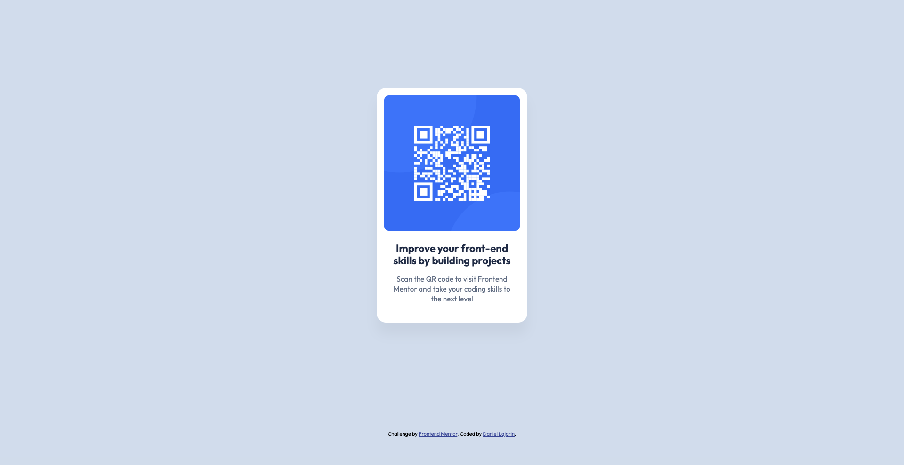

# Frontend Mentor - QR code component solution

This is a solution to the [QR code component challenge on Frontend Mentor](https://www.frontendmentor.io/challenges/qr-code-component-iux_sIO_H). Frontend Mentor challenges help you improve your coding skills by building realistic projects. 

## Table of contents

- [Overview](#overview)
  - [Screenshot](#screenshot)
  - [Links](#links)
- [My process](#my-process)
  - [Built with](#built-with)
  - [What I learned](#what-i-learned)
  - [Continued development](#continued-development)
  - [Useful resources](#useful-resources)
- [Author](#author)

## Overview
 
### Screenshot

### Links

- [Solution URL](https://github.com/DAJ350/qr-code-component)
- [Live Site URL](https://daj350.github.io/qr-code-component/)

## My process

I started by reviewing the starter code to check for any missing content. After adding the necessary content to the .html file, I moved on to applying the styling rules.

Using the provided Figma design files made the styling process straightforward. After reading Frontend Mentor’s article on working with Figma files, I quickly adapted to the workflow and extracted the necessary design details to make the project as pixel-perfect as possible.

### Built with

- Semantic HTML5 markup
- CSS

### What I learned

I learned how to access and work with Figma design files. I also learned common Figma design conventions used by designers and developers such as the design system, the use of variables and local styles. 

### Continued development

In the future, I would like more practice working with design files. I would also like more practice working with Semantic HTML markup.

### Useful resources

- [Resource 1](https://www.frontendmentor.io/learning-paths/getting-started-on-frontend-mentor-XJhRWRREZd/steps/66c6e6bd3c19191dc30f3b7e/article/read) - This helped me Understand how to get started with Frontend Mentor projects.

- [Resource 2](https://www.frontendmentor.io/articles/figma-for-developers-how-to-work-with-a-design-file-m6CZKZ1rC1) - This is an amazing article which helped me finally how to work with Figma design files.. I'd recommend it to anyone still learning this concept.

## Author

- GitHub - [DAJ350](https://github.com/DAJ350)
- Frontend Mentor - [@DAJ350](https://www.frontendmentor.io/profile/DAJ350)
